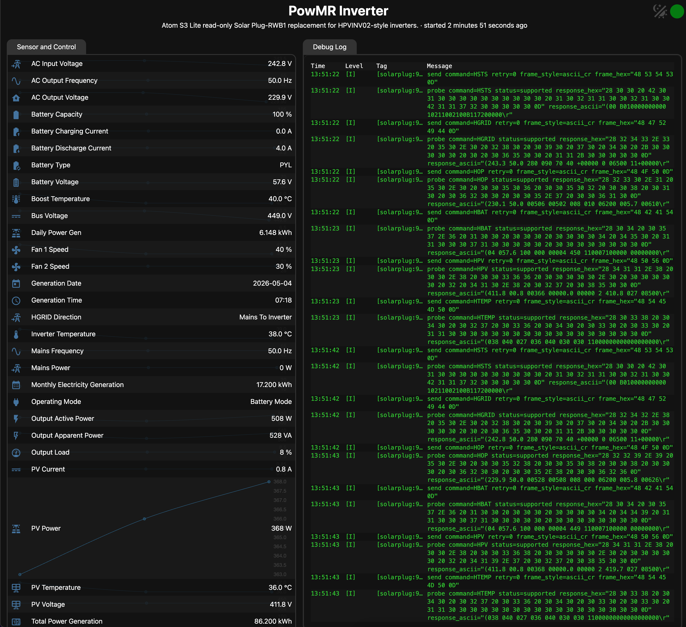

# solarplug-esphome

ESPHome external component and decoder tools for local, read-only replacement of Solar Plug / Solar of Things RS232 Wi-Fi dongles on compatible HPVINV02-style inverters.

This project was developed from passive serial captures and active read-only probes on a PowMr / MrPow `POW-HVM6.2KP` inverter reporting `HPVINV02`, `VMII-6200`, and firmware/software `40.05`. The original dongle used for sniffing was `WIFI-RELAB`.

Search terms: Solar Plug-RWB1, RWB1-06R, WIFI-RELAB, Solar of Things, HPVINV02, PowMr, MrPow, Relab, Datouboss, TECHFINE, HVM6.2KP, HVM11KP, VMII-6200, ESPHome.



## What Works

The v1 component is read-only by default. It polls the same H-command telemetry family observed from the original dongle and publishes stable ESPHome entities:

- inverter status and operating mode
- AC input/output voltage, frequency, power, and load
- battery voltage, SOC, charge/discharge current, and bus voltage
- PV voltage/current/power
- inverter temperatures and fan speeds
- native daily/monthly/yearly/total PV generation counters from `HGEN`
- protocol identity and firmware strings

Diagnostic blocks such as `HBMS*`, `HEEP*`, `HPVB`, and raw payloads are available only as diagnostic/default-disabled entities. Public v1 examples stay read-only. A separate beta profile exposes selected ACK-tracked write controls for protocol validation.

## Compatibility

Confirmed:

| Inverter | Dongle | Status |
|---|---|---|
| `POW-HVM6.2KP` | `WIFI-RELAB` | confirmed read-only replacement |

Likely compatible but unverified because they are listed for the same `WIFI-RELAB` module:

- `POW-HVM11KP`
- `POW-RELAB 3KU`
- `POW-RELAB 3KE`
- `POW-RELAB 5KU`
- `POW-RELAB 5KE`
- `POW-RELAB 10KU`
- `POW-RELAB 10KE`
- `POW-RELAB SPLIT Series`

See [docs/protocol/COMPATIBILITY.md](docs/protocol/COMPATIBILITY.md) for the full model matrix and how to submit redacted captures for another inverter.

## Wiring

Use the inverter port labeled `RS232` or `COM`. Solar Assistant documents the PowMr HVM KP-series RJ45 pinout as pin 3 = inverter RX, pin 4 = GND, and pin 6 = inverter TX. The POW-HVM6.2KP manual also lists pin 5 as GND, while field reports for this exact model use pin 2/4 as voltage rails for small interface modules. For this project, use pin 4 as ground, optionally tie pin 5 to the same RS232 adapter ground, and leave pin 2 disconnected unless you have verified your exact inverter/cable.


Do not connect the inverter RS232 port directly to ESP32 GPIO. ESP32 TX/RX must go through a MAX3232-style RS232 transceiver, an RS232 base, or a known-compatible USB RS232 cable. See [docs/hardware/RS232_WIRING.md](docs/hardware/RS232_WIRING.md) for the pin table and cable notes. Image source: [Solar Assistant PowMr HVM KP-series RS232 guide](https://solar-assistant.io/help/inverters/powmr/POW-HVM-KP/rs232).

## Install

Use ESPHome external components:

```yaml
external_components:
  - source: github://kOld/solarplug-esphome@main
    components: [solarplug]
    refresh: 1d
```

Reusable entity packages are also available:

```yaml
packages:
  solarplug_reader: github://kOld/solarplug-esphome/packages/solarplug-read-full.yaml@main
```

## Minimal Active Reader

Use active mode only when the original Solar Plug is disconnected and the ESP32 is the only RS232 master.

```yaml
uart:
  id: uart_main
  tx_pin: GPIO17
  rx_pin: GPIO16
  baud_rate: 2400
  data_bits: 8
  parity: NONE
  stop_bits: 1

solarplug:
  id: solarplug_reader
  uart_id: uart_main
  passive_mode: false
  sensors:
    output_active_power: { name: Output Active Power }
    battery_voltage: { name: Battery Voltage }
    pv_power: { name: PV Power }
    total_power_generation: { name: Total Power Generation }
  text_sensors:
    operating_mode: { name: Operating Mode }
```

Complete examples are in `examples/`.

The examples keep board, Wi-Fi, API, OTA, web server, and UART wiring in the device YAML. The Solar Plug entity surface lives in `packages/` so users can include the full reader package, a minimal reader package, the passive sniffer package, or layer the beta write package on top. ESPHome package merging allows local configs to override, extend, or remove individual entities without copying the whole component block.

The Atom S3 Lite replacement example uses ESPHome's `esp-idf` framework. The component does not depend on Arduino APIs, and the pure ESP-IDF build avoids a certificate-generation failure seen with the mixed Arduino/ESP-IDF toolchain in ESPHome 2026.1.2.

The beta write example is separate: `examples/atom-s3-lite-write-beta.yaml`. It exposes only documented write families and requires `enable_writes: true` plus `write_profile: beta`. NAK-only or unsupported research probes require the separate `write_profile: unsafe` opt-in and are not enabled in the normal beta example.

Raw UART frame logs and decoded per-field logs are opt-in (`raw_frame_logging` and `decoded_field_logging`). Keep both off in normal firmware; enable them only for capture/replay work where the extra log formatting and network log traffic are useful.

## Safety

RS232 is a single-master path. Do not connect the original Solar Plug and an active ESPHome reader as simultaneous masters.

The default component configuration only sends read-only labels such as `HSTS`, `HGRID`, `HOP`, `HBAT`, `HPV`, `HTEMP`, `HGEN`, `QPRTL`, and `HIMSG1`. Setter/control families such as `PD*`, `PE*`, `PBEQV*`, `PBEQP*`, `PBEQOT*`, `PBEQT*`, `PSDV*`, `PDSRS*`, `PDDLYT*`, `^S???DAT*`, and `PCPxx` are excluded from production examples.

A separate beta write example exists for controlled testing. It requires `enable_writes: true`, exposes only bus-confirmed families, publishes a `last_write_status` diagnostic, and has no arbitrary command sender.

## Documentation

- Protocol command table: `docs/protocol/H_COMMANDS.md`
- Current confidence/status: `docs/protocol/CURRENT_FIELD_STATUS.md`
- HGEN reset behavior: `docs/protocol/HGEN_ROLLOVER.md`
- Compatibility notes: `docs/protocol/COMPATIBILITY.md`
- Beta write surface: `docs/protocol/WRITE_SURFACE.md`
- Write beta workflow: `docs/protocol/WRITE_BETA_WORKFLOW.md`
- Write test ledger: `docs/protocol/WRITE_TEST_LEDGER.md`
- Replay workflow: `docs/protocol/REPLAY_WORKFLOW.md`
- Hardware wiring: `docs/hardware/RS232_WIRING.md`
- Component design: `docs/COMPONENT_DESIGN.md`

## Development

Run decoder tests:

```bash
python3 -m unittest tests/test_decode_h_protocol.py
```

The repository intentionally excludes local ESPHome build output, secrets, raw private capture corpora, and cloud account tooling. Keep public fixtures synthetic or redacted.

## Status

The read-only replacement path is beta quality on the confirmed PowMr/MrPow HPVINV02 setup. Models listed for the same `WIFI-RELAB` module are likely compatible, but must be validated with captures before being listed as confirmed.
